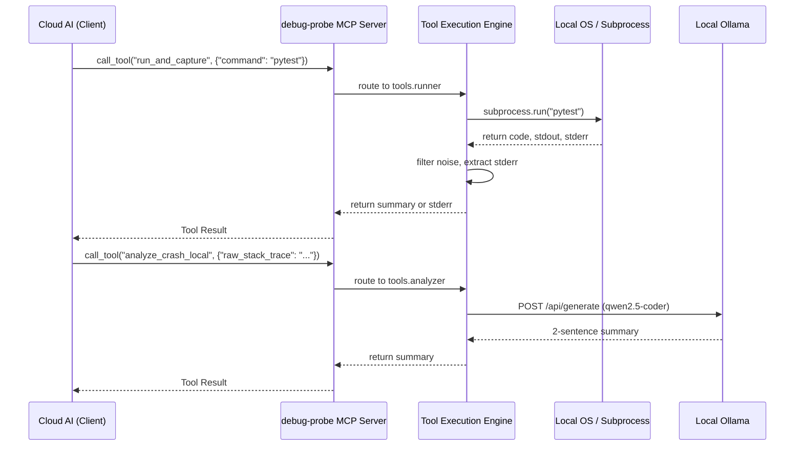

# Flows

```mermaid
sequenceDiagram
    participant Cloud_AI as Cloud AI (Client)
    participant Server as debug-probe MCP Server
    participant Tool as Tool Execution Engine
    participant OS as Local OS / Subprocess
    participant Ollama as Local Ollama

    %% Run and Capture Flow
    Cloud_AI->>Server: call_tool("run_and_capture", {"command": "pytest"})
    Server->>Tool: route to tools.runner
    Tool->>OS: subprocess.run("pytest")
    OS-->>Tool: return code, stdout, stderr
    Tool->>Tool: filter noise, extract stderr
    Tool-->>Server: return summary or stderr
    Server-->>Cloud_AI: Tool Result

    %% Analyze Crash Flow
    Cloud_AI->>Server: call_tool("analyze_crash_local", {"raw_stack_trace": "..."})
    Server->>Tool: route to tools.analyzer
    Tool->>Ollama: POST /api/generate (qwen2.5-coder)
    Ollama-->>Tool: 2-sentence summary
    Tool-->>Server: return summary
    Server-->>Cloud_AI: Tool Result
```
