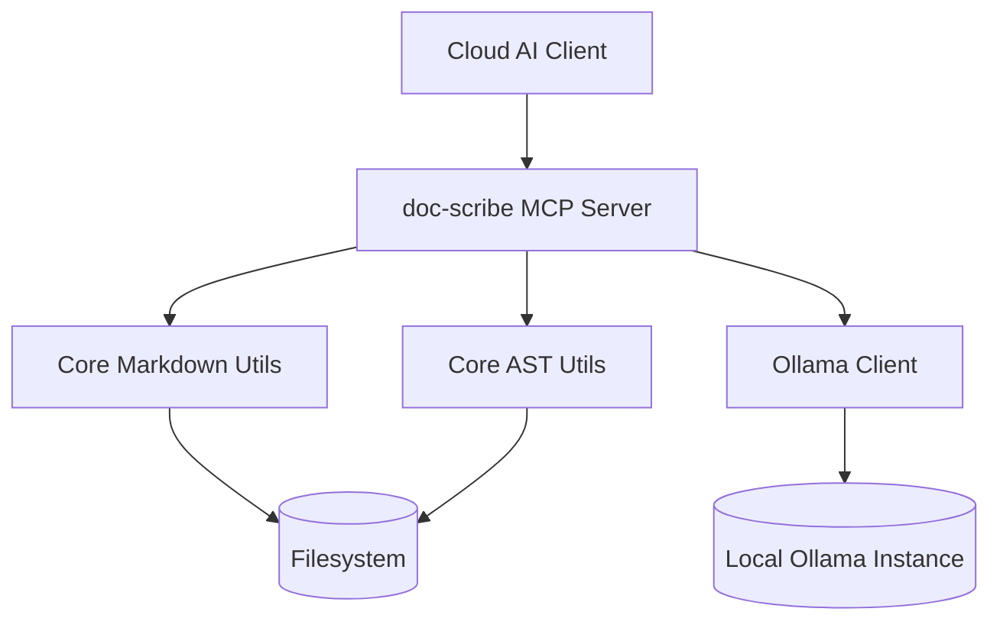

# doc-scribe Architecture

The `doc-scribe` server follows a hybrid strategy for documentation management:

1.  **Deterministic Layer (Python)**:
    -   Uses Regex and AST for structural markdown manipulation.
    -   Ensures indentation, formatting, and file integrity are preserved.
    -   Tools: `get_markdown_toc`, `patch_doc_section`.

2.  **AI Offloading Layer (Local LLM)**:
    -   Uses Ollama (`qwen2.5-coder:14b`) for heavy text processing.
    -   Focuses on summarization and docstring generation to save cloud tokens.
    -   Tools: `summarize_doc_local`, `generate_inline_docs`.

## Component Interaction

