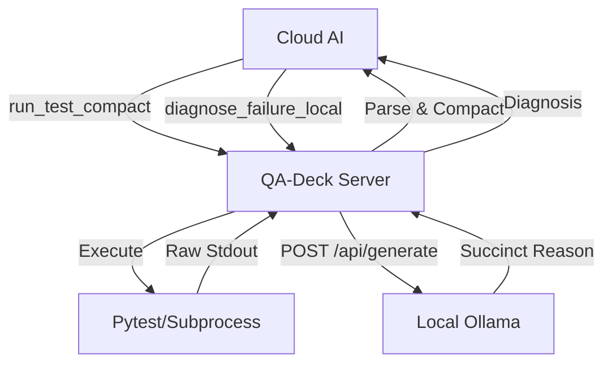

# Architecture: QA-Deck

## Overview
`qa-deck` is a specialized MCP server designed to optimize the quality assurance workflow for Cloud AI agents. It acts as a middleware between test frameworks and the AI, ensuring that only relevant, high-signal information is transmitted.

## Components

### 1. Test Runner (`run_test_compact`)
- Intercepts test execution.
- Parses `pytest` (and potentially other frameworks) output.
- Filters out "passed" noise.
- Returns a JSON summary and concise failure details.

### 2. Coverage Analyzer (`get_coverage_gaps`)
- Parses standard coverage formats (`coverage.xml`).
- Maps missing coverage directly to line numbers.
- Prevents the AI from having to read massive reports.

### 3. Local Diagnoser (`diagnose_failure_local`)
- Offloads heavy stack trace analysis to local hardware.
- Uses Ollama (`qwen2.5-coder:14b`) to summarize errors.
- Reduces token burn and context window pressure on the Cloud AI.

## Flow

