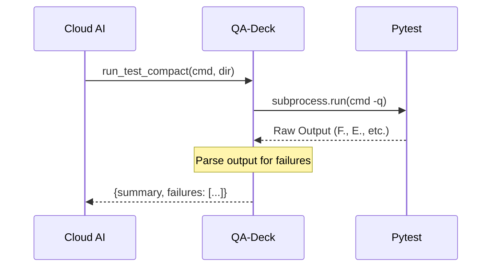
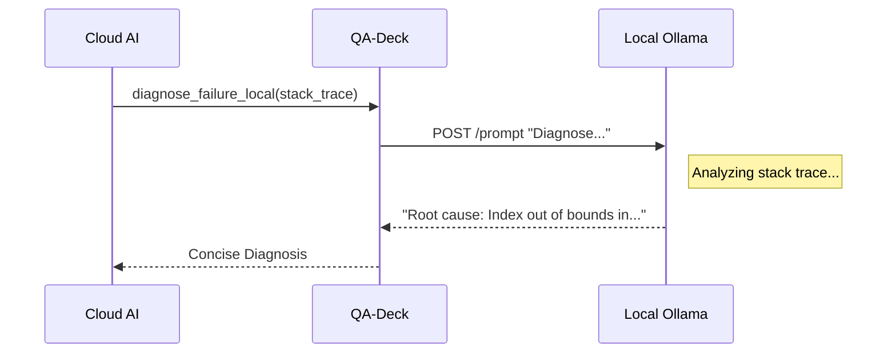

# Test & Diagnosis Flows

## Test Execution Flow

```mermaid
sequenceDiagram
    participant AI as Cloud AI
    participant QD as QA-Deck
    participant PT as Pytest
    
    AI->>QD: run_test_compact(cmd, dir)
    QD->>PT: subprocess.run(cmd -q)
    PT-->>QD: Raw Output (F., E., etc.)
    Note over QD: Parse output for failures
    QD-->>AI: {summary, failures: [...]}
```

## Failure Diagnosis Flow

```mermaid
sequenceDiagram
    participant AI as Cloud AI
    participant QD as QA-Deck
    participant OL as Local Ollama
    
    AI->>QD: diagnose_failure_local(stack_trace)
    QD->>OL: POST /prompt "Diagnose..."
    Note right of OL: Analyzing stack trace...
    OL-->>QD: "Root cause: Index out of bounds in..."
    QD-->>AI: Concise Diagnosis
```
